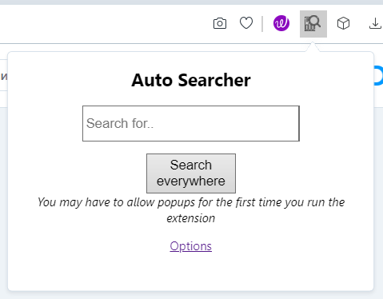

# AutoSearcherExtention
Search for a query in multiple predefined websites.
Open all sites in new window in your browser. 
The extention is useful for finding stuff you know you can find but are not sure where to search for them, and just search for the same thing everywhere.

The extention based on Chrome extentions.

## To install:
Open your browser extensions page and enable developer options.
Clone the repo and simply add the folder as unpacked extention.

Version 0.1.2 Tested on Opera Browser.
Version 0.1.1 Tested on Vivaldi Browser.

## Known Issues:
The extension may fail to load all of the sites.
It works normally if its just used as plain html page, but when is a popup extensions it may not load them all.

## Credits:
Main programming: Krasen Ivanov 2019 - 2022.
Icon pack made by Freepik from www.flaticon.com and is licensed by CC 3.0 BY.

### Stuff I want to implement:
Ability to add and remove custom sites to search within.
Auto add copied text from the clipboard and search.